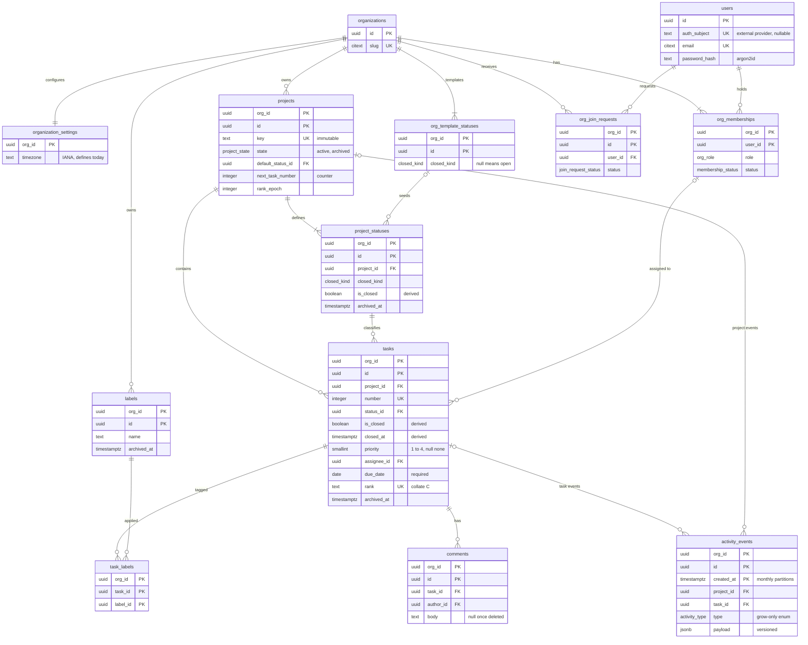

# Task 1.2: Data Model and Technical Design

Stack: PostgreSQL 18, Prisma 7, a NestJS GraphQL API, PgBouncer in transaction mode. Full detail: [design-reference.md](design-reference.md).

## 1. Overview

The design targets 500+ organizations with projects of 2,000+ tasks, and holds at 100x that volume without a schema rewrite. It guarantees four outcomes:

1. One organization can never read or write another organization's data, even when application code has a bug.
2. Dragging a card on the board writes one row and needs no board refetch.
3. Every change is recorded in append-only history, in the same transaction as the change.
4. Board statistics always match the visible board, because they use the same filter and read the same snapshot.

## 2. Data Model Rationale

### 2.1 Principles

1. **One tenant boundary.** The organization is the only isolation unit. Every tenant row carries `org_id`.
2. **No hard deletes.** Members deactivate. Projects, statuses, labels, and tasks archive, so history stays valid.
3. **Immutable identity.** Ids, project keys, and task numbers never change meaning. `ENG-123` is permanent.
4. **Triggers derive and guard. The API decides and records.** Every intent-bearing change comes from the API and writes an activity event.
5. **One definition per concept.** Open, overdue, and today are each defined once and used everywhere.

### 2.2 Entities and relationships

Every tenant table has the primary key `(org_id, id)`, and every foreign key between tenant tables includes `org_id`. A task in org A cannot reference a status, label, or person in org B. References to people point at `org_memberships (org_id, user_id)`, which proves membership. A join request is the one exception, because its requester is not yet a member. `users` and `refresh_tokens` are the only global tables.



Statuses are per-project columns copied from an org template. Each is open, completed, or canceled through `closed_kind`. Tasks copy `is_closed` from their status by trigger, so "open" is one indexed column.

### 2.3 Roles

| Capability | owner | admin | member | contributor |
|---|:-:|:-:|:-:|:-:|
| Manage owners | ✓ | | | |
| Org settings, status template, manage non-owner members and join requests | ✓ | ✓ | | |
| Create, archive, restore projects; edit project statuses | ✓ | ✓ | ✓ | |
| Create, rename, archive labels | ✓ | ✓ | ✓ | |
| Create, edit, move, archive, restore tasks; apply labels | ✓ | ✓ | ✓ | ✓ |
| Comment; edit or delete own comment | ✓ | ✓ | ✓ | ✓ |
| Delete another member's comment | ✓ | ✓ | | |
| Read everything in the org | ✓ | ✓ | ✓ | ✓ |

The brief's viewer is named contributor, because the role edits tasks. A read-only role is one added enum value.

### 2.4 Key choices

| Choice | Why | Cost accepted |
|---|---|---|
| Global users plus org memberships | One login across orgs. Deactivation keeps history valid. | No invitations for non-users in v1 |
| Freeform statuses with `closed_kind` | Teams own their workflow; the system still knows what done means | No enforced transitions in v1 |
| Fractional string rank, generated by the server | A drag is one row write. Stale clients cannot corrupt order. | Periodic rebalance |
| Priority as `smallint` 1 to 4, null for none | Stable ordering and chart axis | Display names live in settings |
| Required `date` due dates in the org timezone | One overdue count per org. Every sort key is non-null. | One timezone per org |
| One typed history table, versioned JSON, monthly partitions | Partitioning later would be a full copy | Readers handle every payload version |
| Aggregates at query time | No counter drift | Escalation path in section 4.4 |

## 3. Query Patterns

### 3.1 Shared definitions

| Term | Definition |
|---|---|
| Today | `(now() AT TIME ZONE org.timezone)::date`, computed once per request |
| Open | `tasks.is_closed = false`, derived from the status |
| Overdue | Open, not archived, `due_date < today`, and the project is active |

Every read request runs in one `REPEATABLE READ READ ONLY` transaction, so a list and its summary see the same snapshot. The org's inactive project ids are read once per request. Every query uses this overdue predicate as written:

```sql
NOT t.is_closed AND t.archived_at IS NULL AND t.due_date < $today
AND t.project_id <> ALL ($inactive_projects)
```

No overdue query joins `projects`. Pages fetch `first + 1` rows to set `hasNextPage`.

### 3.2 My overdue tasks across projects

```sql
SELECT t.id, t.project_id, t.number, t.title, t.status_id, t.priority, t.due_date
FROM tasks t
WHERE t.org_id = $org
  AND t.assignee_id = $me
  AND t.archived_at IS NULL
  AND t.is_closed = false
  AND t.due_date < $today
  AND t.project_id <> ALL ($inactive_projects)
  AND (t.due_date, t.id) > ($cursor_due, $cursor_id)          -- omitted on page one
ORDER BY t.due_date, t.id
LIMIT $first + 1;
```

One range scan on `tasks_overdue_by_assignee`, whose partial predicate matches the query. `(due_date, id)` is a complete cursor.

### 3.3 Board: first page of every column in one round trip

```sql
SELECT s.id AS status_id, x.*
FROM project_statuses s
CROSS JOIN LATERAL (
  SELECT t.id, t.number, t.title, t.priority, t.assignee_id, t.due_date, t.rank
  FROM tasks t
  WHERE t.org_id = s.org_id AND t.project_id = s.project_id AND t.status_id = s.id
    AND t.archived_at IS NULL
  ORDER BY t.rank
  LIMIT $first + 1
) x
WHERE s.org_id = $org AND s.project_id = $project AND s.archived_at IS NULL
ORDER BY s.position, x.rank;
```

Each column is an ordered range scan on `tasks_board`. Cost is columns times page size, not project size. Loading more of one column adds `rank > $cursor`.

### 3.4 Summary: every breakdown in one statement

```sql
SELECT status_id, assignee_id, priority,
       GROUPING(status_id) AS g_status, GROUPING(assignee_id) AS g_assignee, GROUPING(priority) AS g_priority,
       count(*)                                   AS total,
       count(*) FILTER (WHERE NOT is_closed)      AS open,
       count(*) FILTER (WHERE <overdue condition>) AS overdue
FROM tasks t
WHERE org_id = $org AND <same predicate as the task list>
GROUP BY GROUPING SETS ((status_id), (assignee_id), (priority), ());
```

`GROUPING()` separates a real NULL (unassigned, no priority) from a grouping-set NULL. The API zero-fills statuses and priorities. Every breakdown sums to `total`.

### 3.5 Other patterns

| Operation | Shape | Index |
|---|---|---|
| Resolve `ENG-123` | Project by `(org_id, key)`, then task by `(org_id, project_id, number)` | Unique `(org_id, key)`, `tasks_number_unique` |
| `labelsAll` filter | Group `task_labels` by task, keep tasks whose match count equals `cardinality($ids)` | `task_labels_by_label` |

## 4. Indexing and Performance

### 4.1 Rules

1. Every index leads with `org_id`, the first key of the security predicate.
2. Hot-path indexes are partial on `archived_at IS NULL`, so unbounded archives stay off the board, overdue, and filter paths.
3. One index per access path, named for it.

### 4.2 Read-path indexes

| Index | Serves |
|---|---|
| `tasks_board (org_id, project_id, status_id, rank)` live | Board columns in order, per-column pagination |
| `tasks_project_created (org_id, project_id, id)` live | Default order, newest first (UUIDv7 ids are time-ordered) |
| `tasks_org_created (org_id, id)` live | The same order across projects |
| `tasks_project_due (org_id, project_id, due_date)` live | Due-date range filter, due-date order |
| `tasks_project_priority (org_id, project_id, coalesce(priority, 5), id)` live | Priority order, with no priority last |
| `tasks_project_assignee (org_id, project_id, assignee_id)` live | Assignee filter, per-assignee summary |
| `tasks_overdue_by_assignee (org_id, assignee_id, due_date)` open, live | My overdue tasks |
| `tasks_number_unique (org_id, project_id, number)` | Identifier resolution |
| `task_labels_by_label (org_id, label_id, task_id)` | Label filters |

`tasks` carries 13 indexes in total. The design reference lists the other five.

### 4.3 Costs accepted

| Area | Cost | Response |
|---|---|---|
| Task writes | 13 indexes. Only title and description edits are HOT-eligible. | Cheap at board edit rates. Revisit if write p95 rises. |
| Filtered boards | A selective filter on a huge column scans the column | Trivial at 2,000 tasks. Watch the plan at 100x. |
| History growth | Monthly partitions, kept forever | Timelines are bounded by task creation time, which prunes old partitions |

### 4.4 Aggregate escalation

Aggregates stay at query time until the org-level summary p95 exceeds 150 ms in production. Then a `project_status_counts` table gets delta upserts in the mutation transaction, locked in `status_id` order, with a nightly reconciliation that reports every repair.

## 5. Multi-Tenancy Isolation

### 5.1 Three layers

| Layer | Mechanism | Failure it prevents |
|---|---|---|
| Column | `org_id` on every tenant row, leading every index | Unscoped scans |
| Reference | Composite foreign keys that include `org_id` | A row in org A pointing at a row in org B |
| Access | Forced row-level security, policy `org_id = (SELECT app.current_org_id())` | A leak from a missing filter in application code |

### 5.2 Rules

1. **Transaction-local context.** `set_config(..., true)` sets user and org. A session setting would leak the tenant behind PgBouncer.
2. **Fail closed.** Without context, `app.current_org_id()` is NULL and no row matches.
3. **One org per request.** The first statement reads the caller's own membership, so nothing runs for an org the caller does not belong to.
4. **Narrow cross-tenant paths.** Only the org switcher and join requests cross tenants, each through a definer function on a role that sees only the caller's own rows.
5. **No existence leaks.** A hidden row surfaces as `NOT_FOUND`, never `FORBIDDEN`.
6. **Context once per query.** Policies wrap the context call in a subquery. Context functions are `PARALLEL SAFE`.

### 5.3 Tenant policy

```sql
ALTER TABLE tasks ENABLE ROW LEVEL SECURITY;
ALTER TABLE tasks FORCE ROW LEVEL SECURITY;

CREATE POLICY tenant ON tasks
  USING      (org_id = (SELECT app.current_org_id()))
  WITH CHECK (org_id = (SELECT app.current_org_id()));
```

Every hot query also carries an explicit `org_id = $org`, so plans match the leading index column.

### 5.4 Database roles

| Role | Purpose |
|---|---|
| `app_owner` | Owns every object. Runs migrations. Never a superuser. |
| `app_runtime` | The API's only login. Holds no privileges until each transaction runs `SET LOCAL ROLE`, so a query outside a request transaction fails. |
| `app_user` | API runtime. In `users`, reads only itself and current-org members. Cannot update project keys, identity columns, or history. |
| `app_membership_reader` | Org switcher only. Reads the caller's memberships and org names. |
| `app_identity` | Sign up, sign in, refresh tokens, and member lookup. Grants on `users` and `refresh_tokens` only. |
| `app_join` | Join requests. Reads and writes only the caller's own requests. |

### 5.5 Checks

CI fails if `users` or any `org_id` table lacks forced row-level security, or if a tenant table has any other policy for `app_user`. Plans are checked with `EXPLAIN` as `app_user`, because a superuser bypasses row-level security.

## 6. Migration Strategy

### 6.1 Ownership

The Prisma schema (`api/prisma/schema/`, one file per domain) defines tables, keys, relations, enums, and partial indexes (through Prisma's `partialIndexes` preview feature), and its generated migrations are committed unedited. Row-level security, policies, grants, triggers, partitioning, checks, and expression indexes are hand-written SQL in `--create-only` migrations. History partitions live in schema `history_parts`, outside Prisma's model. CI applies the chain to an empty database and fails on any drift from `schema.prisma`.

### 6.2 Principles

1. **Expand and contract.** A breaking change ships as expand, migrate (dual-write and backfill), then contract.
2. **Lock safety.** `lock_timeout = '3s'`. No exclusive lock on `tasks` or `activity_events` beyond a metadata change.
3. **History is never migrated.** New payloads bump `schema_version`. Readers handle every version.
4. **Backfills are per-org jobs.** Each org runs in its own transaction with context set. Without context, row-level security makes a backfill update zero rows and still report success.

### 6.3 Safe operations

| Change | Safe form |
|---|---|
| Make a column required | `NOT VALID` check, `VALIDATE`, then `SET NOT NULL` skips the scan |
| Add a foreign key or index on a large table | Foreign key `NOT VALID` then `VALIDATE`; index `CONCURRENTLY` in its own migration |
| Add an activity event type | Add the enum value, metadata-only, before any code writes it |
| Add a tenant table | The same release adds forced row-level security, the tenant policy, and grants |

### 6.4 Worked example: multiple assignees

1. **Expand.** Add `task_assignees (org_id, task_id, user_id)` with row-level security. Add `Task.assignees`.
2. **Dual-write.** The API writes both in one transaction.
3. **Backfill.** A per-org job copies assignments until a mismatch count returns zero.
4. **Switch.** Reads, filters, the summary, and the assignment guard move to the join table.
5. **Contract.** Deprecate `Task.assignee`, then drop `assignee_id` one release later.
