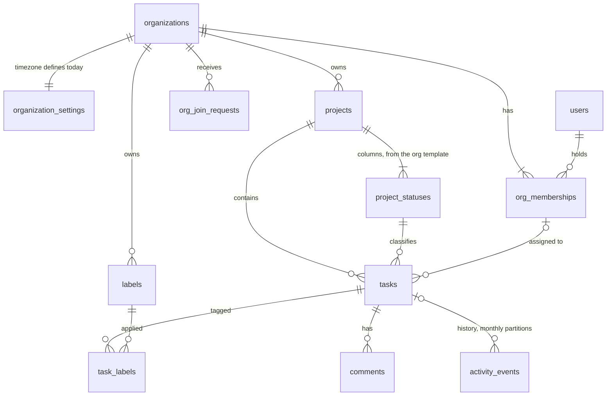

# Task 1.2: Data Model and Technical Design

Stack: PostgreSQL 18, Prisma 7, a NestJS GraphQL API, PgBouncer in transaction mode. Full detail: the design reference, [data](design-reference-data.md) and [API](design-reference-api.md).

## 1. Overview

The design targets 500+ organizations with projects of 2,000+ tasks, and holds at 100x without a schema rewrite. It guarantees that one organization never reads or writes another's data, even through an application bug; that every change is recorded in history in the same transaction; and that board statistics always match the visible board.

## 2. Data Model Rationale

### 2.1 Principles

1. **One tenant boundary.** The organization is the only isolation unit. Every tenant row carries `org_id`.
2. **No hard deletes.** Members deactivate; projects, statuses, labels, and tasks archive, so history stays valid.
3. **Immutable identity.** Ids, project keys, and task numbers never change meaning. `ENG-123` is permanent.
4. **Triggers derive and guard; the API decides and records.**
5. **One definition per concept.** Open, overdue, and today are defined once (section 3.1).

### 2.2 Entities and relationships

Every tenant table has the primary key `(org_id, id)`, and every foreign key between tenant tables includes `org_id`, so a task in org A cannot reference a status, label, or person in org B. People are referenced through `org_memberships (org_id, user_id)`, which proves membership. `users` and `refresh_tokens` are the only global tables.



Statuses are per-project, each open, completed, or canceled through `closed_kind`. Tasks copy `is_closed` from their status by trigger, so "open" is one indexed column. A task has a per-project `number`, a required `due_date`, `priority` 1 to 4 (null for none), and a `rank` string for board order.

### 2.3 Roles

| Capability | owner | admin | member | contributor |
|---|:-:|:-:|:-:|:-:|
| Manage owners | ✓ | | | |
| Org settings, status template, non-owner members, join requests | ✓ | ✓ | | |
| Projects, project statuses, labels | ✓ | ✓ | ✓ | |
| Create, edit, move, archive tasks; comment | ✓ | ✓ | ✓ | ✓ |
| Delete another member's comment | ✓ | ✓ | | |
| Read everything in the org | ✓ | ✓ | ✓ | ✓ |

The brief's viewer is named contributor, because the role edits tasks. A read-only role is one added enum value.

### 2.4 Key choices

| Choice | Why | Cost accepted |
|---|---|---|
| Global users plus memberships | One login across orgs; deactivation keeps history valid | No invitations for non-users in v1 |
| Freeform statuses with `closed_kind` | Teams own their workflow; the system still knows what done means | No enforced transitions |
| Server-generated rank keys (`COLLATE "C"`) | A drag writes one row; clients never send positions | Rebalance when keys grow (Designed) |
| Required dates in the org timezone | One overdue count per org; every sort key is non-null | One timezone per org |
| One typed, partitioned history table | Partitioning later would be a full copy | Readers handle every payload version |
| Aggregates at query time | No counter drift | Escalation path in section 4.4 |

## 3. Query Patterns

### 3.1 Shared definitions

**Today** is `(now() AT TIME ZONE org.timezone)::date`, computed once per request. **Open** is `NOT is_closed`. **Overdue** is open, not archived, due before today, in an active project:

```sql
NOT t.is_closed AND t.archived_at IS NULL AND t.due_date < $today
AND t.project_id <> ALL ($inactive_projects)
```

Every read request runs in one `REPEATABLE READ READ ONLY` transaction, so a list and its summary see the same snapshot. No overdue query joins `projects`. Pages fetch `first + 1` rows to set `hasNextPage`.

### 3.2 My overdue tasks across projects

```sql
SELECT t.id, t.project_id, t.number, t.title, t.status_id, t.priority, t.due_date
FROM tasks t
WHERE t.org_id = $org AND t.assignee_id = $me
  AND <overdue predicate>
  AND (t.due_date, t.id) > ($cursor_due, $cursor_id)   -- omitted on page one
ORDER BY t.due_date, t.id
LIMIT $first + 1;
```

One range scan on `tasks_overdue_by_assignee`, whose partial predicate matches the query. `(due_date, id)` is a complete cursor.

### 3.3 Board: the first page of every column in one round trip

```sql
SELECT s.id AS status_id, x.*
FROM project_statuses s
LEFT JOIN LATERAL (
  SELECT t.* FROM tasks t
  WHERE t.org_id = s.org_id AND t.status_id = s.id AND <filter>
  ORDER BY t.rank LIMIT $first
) x ON true
WHERE s.org_id = $org AND s.project_id = $project AND s.archived_at IS NULL
ORDER BY s.position, x.rank;
```

Each column is an ordered range scan on `tasks_board`, so cost is columns times page size, not project size. Loading more of one column adds `rank > $cursor`.

### 3.4 Summary: every breakdown in one statement

```sql
SELECT status_id, assignee_id, priority,
       GROUPING(status_id), GROUPING(assignee_id), GROUPING(priority),
       count(*) AS total,
       count(*) FILTER (WHERE NOT is_closed) AS open,
       count(*) FILTER (WHERE <overdue predicate>) AS overdue
FROM tasks t WHERE org_id = $org AND <same filter as the list>
GROUP BY GROUPING SETS ((status_id), (assignee_id), (priority), ());
```

`GROUPING()` separates a real NULL (unassigned, no priority) from a grouping-set NULL. The API zero-fills statuses and priorities, so every breakdown sums to the total.

## 4. Indexing and Performance

### 4.1 Rules

1. Every index leads with `org_id`, the first key of the security predicate.
2. Hot-path indexes are partial on `archived_at IS NULL`, so archives stay off the board, overdue, and filter paths.
3. One index per access path, named for it. Plans are checked with `EXPLAIN` as `app_user`, because a superuser bypasses row-level security.

### 4.2 Read-path indexes

| Index (all live-only unless noted) | Serves |
|---|---|
| `tasks_board (org_id, project_id, status_id, rank)` | Board columns in order, per-column pages |
| `tasks_project_created (org_id, project_id, id)` | Default order (UUIDv7 ids are time-ordered) |
| `tasks_project_due (org_id, project_id, due_date)` | Due-date range and order |
| `tasks_project_priority (org_id, project_id, coalesce(priority, 5), id)` | Priority order, none last |
| `tasks_overdue_by_assignee (org_id, assignee_id, due_date)`, open only | My overdue tasks |
| `tasks_number_unique (org_id, project_id, number)` | Resolving `ENG-123` |
| `task_labels_by_label (org_id, label_id, task_id)` | Label filters |

### 4.3 Costs accepted

`tasks` carries 13 indexes; only title and description edits are HOT-eligible, which is cheap at board edit rates. A selective filter on a huge column scans that column: trivial at 2,000 tasks, to watch at 100x. History grows forever in monthly partitions; timelines are bounded by task creation time, which prunes old partitions.

### 4.4 Aggregate escalation

Aggregates stay at query time until the org-level summary p95 exceeds 150 ms in production. Then a `project_status_counts` table gets delta upserts in the mutation transaction, locked in `status_id` order, with a nightly reconciliation that reports every repair.

## 5. Multi-Tenancy Isolation

### 5.1 Three layers

| Layer | Mechanism | Failure it prevents |
|---|---|---|
| Column | `org_id` on every tenant row, leading every index | Unscoped scans |
| Reference | Composite foreign keys that include `org_id` | A row in org A pointing at org B |
| Access | Forced row-level security: `org_id = (SELECT app.current_org_id())` | A leak from a missing filter in code |

### 5.2 Rules

1. **Transaction-local context.** `set_config(..., true)` sets user and org; a session setting would leak the tenant behind PgBouncer.
2. **Fail closed.** Without context, `app.current_org_id()` is NULL and no row matches.
3. **One org per request.** The first statement reads the caller's own membership; nothing runs for an org the caller is not in.
4. **Narrow cross-tenant paths.** Only the org switcher and join requests cross tenants, each through a definer function that sees only the caller's rows.
5. **No existence leaks.** A hidden row is `NOT_FOUND`, never `FORBIDDEN`.

### 5.3 Database roles

`app_owner` owns every object and runs migrations; it is never a superuser. The API logs in as `app_runtime`, which has no privileges of its own until each request transaction runs `SET LOCAL ROLE app_user`, so a query outside a request transaction fails. Narrow roles serve sign-in (`app_identity`), the org switcher (`app_membership_reader`), and join requests (`app_join`). CI fails if any `org_id` table lacks forced row-level security or has another policy for `app_user`.

## 6. Migration Strategy

The Prisma schema (`api/prisma/schema/`, one file per domain) defines tables, keys, relations, enums, and partial indexes, and its generated migrations are committed unedited. Row-level security, policies, grants, triggers, checks, partitioning, and expression indexes are hand-written SQL inside Prisma migrations. CI applies the whole chain to an empty database.

1. **Expand and contract.** A breaking change ships as expand, migrate (dual-write, backfill), then contract.
2. **Lock safety.** `lock_timeout = '3s'`; indexes on large tables are built `CONCURRENTLY`; checks and foreign keys are added `NOT VALID`, then validated.
3. **History is never migrated.** New payloads bump `schema_version`; readers handle every version.
4. **Backfills are per-org jobs** with tenant context set. Without it, row-level security makes an update touch zero rows and still report success.

### 6.4 Worked example: multiple assignees

Add `task_assignees (org_id, task_id, user_id)` with row-level security and `Task.assignees` (expand). The API writes both shapes in one transaction (dual-write). A per-org job copies assignments until a mismatch count is zero (backfill). Reads, filters, the summary, and the assignment guard move to the join table (switch). Then `Task.assignee` is deprecated and `assignee_id` dropped a release later (contract).
