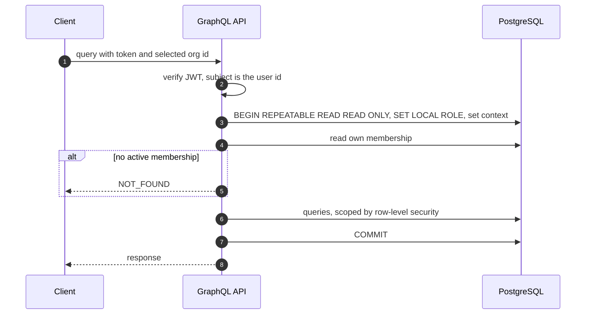

# Task 2.1: API Design Decisions

**Authorization.** The API's login role has no privileges until the transaction switches to `app_user`. The request reads the caller's membership once and stores the role in context. `authorize(capability)` is a pure function of that role. Row-level security scopes every query to the selected org, so a missing filter returns nothing. A task in another org returns `NOT_FOUND`, never `FORBIDDEN`, so ids reveal nothing.

**Filtering.** One `TaskFilter` input serves both `tasks` and `taskSummary`. Fields combine with AND, and lists with OR. `Priority.NONE` maps to SQL `NULL`. Both build their `WHERE` clause from one function and run in one read-only snapshot, so the summary always matches the list.

**Pagination.** Cursors are opaque base64 of the sort key plus id. Every order has a unique tiebreaker and an index: newest first (the default, by time-ordered UUIDv7 id), due date, priority, and board rank. The resolver fetches `first + 1` rows to set `hasNextPage`. `first` defaults to 50, with a maximum of 100.

**Summary.** One SQL statement with `GROUPING SETS` returns total, open, and overdue counts, plus breakdowns by status, priority, and assignee. Every breakdown sums to the total. Overdue uses the shared definition, with today computed in the org's timezone.

**Nested fields.** Status, assignee, and labels resolve through request-scoped DataLoaders, so a page of tasks costs a fixed number of queries. A cost and depth limit rejects oversized queries with `QUERY_TOO_COMPLEX`.
